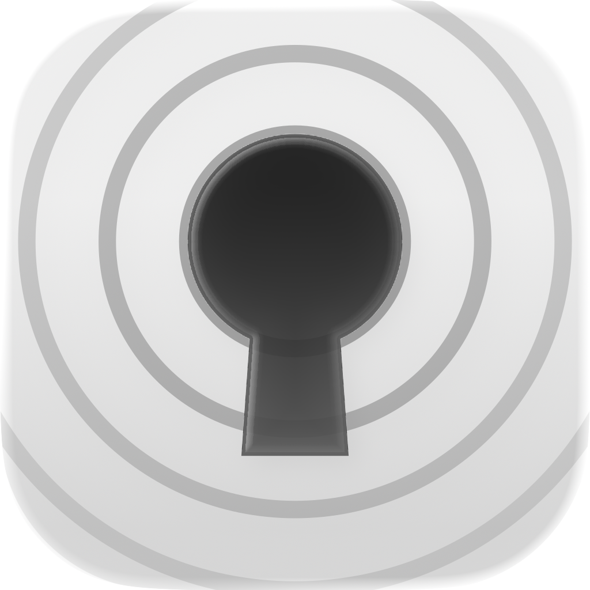
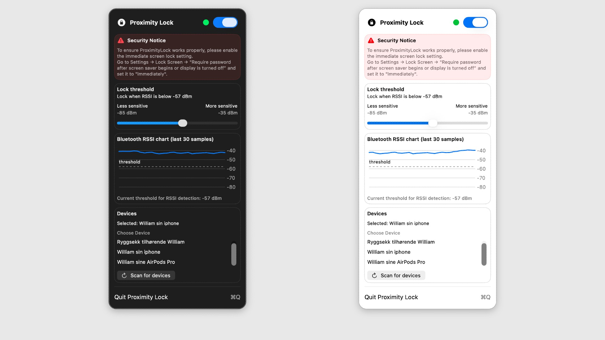

 

  

  <h3 align="center">ProximityLock</h3>

  

  

## About The Project
**ProximityLock** is a macOS app that automatically locks your Mac based on the distance to a selected Bluetooth device.  
It uses the device’s **RSSI (Received Signal Strength Indicator)** to estimate distance, with no companion app or additional setup required.

Because RSSI signals can fluctuate depending on the environment, such as interference from other devices or obstacles, ProximityLock uses a [**Kalman filter**](https://en.wikipedia.org/wiki/Kalman_filter) to smooth noisy signal data. This helps smooth out short-term RSSI spikes caused by interference, making accidental locks less likely.

You can also adjust the lock threshold to control when your Mac locks, allowing you to cusotmize how sensitivie the locking is based on your envrionment. 

> This project is currently a work in progress, but feel free to try it out. All feedback is welcome!

### Why use ProximityLock?
ProximityLock isn’t for everyone, but it helps if you sometimes forget to lock your Mac when stepping away.

If you do forgot to lock your Mac but have ProximityLock on, you can be sure that it got locked anyways, and your Mac is safe! 

## Features
- Lightweight native macOS app that requires minimal resources
- Uses Bluetooth Low Energy (BLE) RSSI for proximity detection  
- Adjustable lock sensitivity (RSSI threshold) 
- Graph with the 30 most recent measurements, so you can more easily choose the right sensitivity
- Kalman filtering for more stable signal readings 
- Initiates screen saver when the threshold is reached
- A grace period after unlocking so it does not instantly lock again (this happened a lot during testing...)
- Remembers selected devices and settings in UserDefaults
- Automatically adapts to system appearance (light/dark mode)
- It is open source, so feel free to fork it and make any changes you want!

## Security Notice
ProximityLock requires the macOS setting that locks your Mac when the screen saver starts.

Go to:  
`Settings → Lock Screen → "Require password after screen saver begins or display is turned off" and set to “Immediately”`

This is necessary because Apple does not provide a public API to directly lock the Mac without using private or third-party tools.

## Usage
Getting started with ProximityLock is simple:

1. Select a Bluetooth device: Choose a Bluetooth device that will be used to estimate your distance from your Mac.

2. Enable Proximity Lock: Turn on Proximity Lock using the toggle at the top of the app.

3. Adjust the lock sensitivity: Use the threshold slider to control when your Mac locks: 
    - Lower values → device must be farther away before locking
    - Higher values → locks sooner

4. Wait for signal calibration: Wait a few moments for the app to collect enough signal samples for accurate tracking.

5. Test ProximityLock by moving the selected Bluetooth device away from the Mac.
    - Does it lock automatically? Great!
  - Does it not lock? Try tweaking the threshold.

## Future Changes
- Lock Mac properly, not only activate the screen saver. This is not currently possible:(
- More settings, like adjust grace period
- Better tuning of measurements
- UI improvements